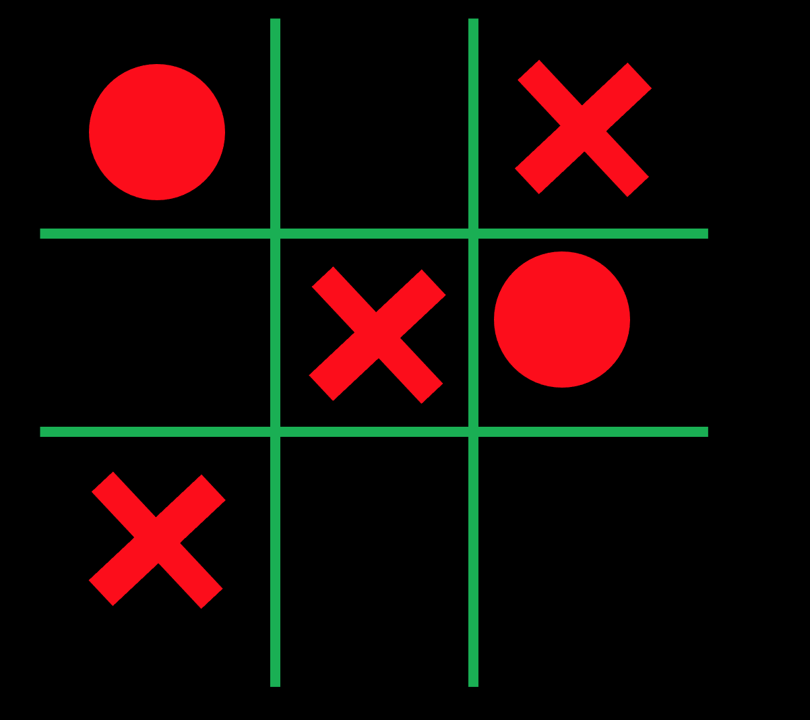
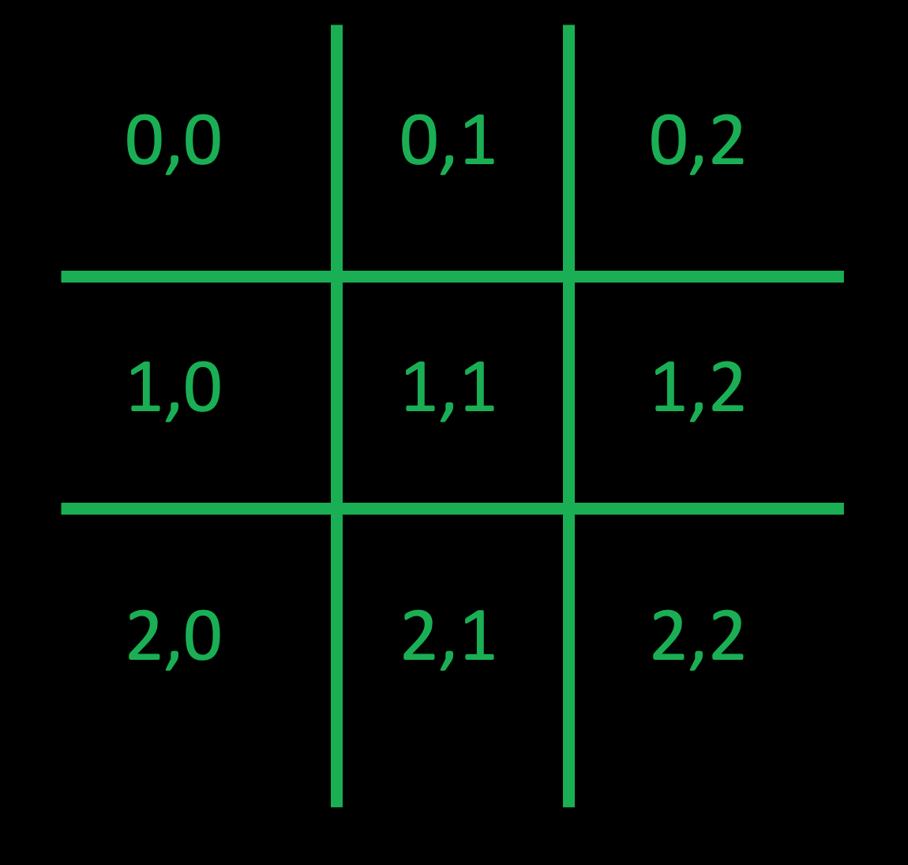
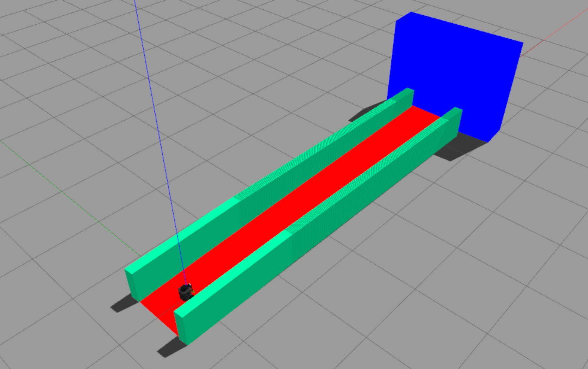

# Robótica Computacional 2021.2

[Mais orientações no README](./README.md)

## Simulado da prova

**Aqui você deverá fazer as 2 questões em um período de 2h.**

**Na prova real haverá 4 questões e você escolherá 3, em um período de 4h**

Esta prova é baseada na [P2 de 2020.2](https://github.com/insper-classroom/202_robot_p2/blob/master/enunciado.ipynb)

Nome:_______________

Questões que fez:____________

Observações de avaliações nesta disciplina:

* Inicie a prova no Blackboard para a ferramenta de Proctoring iniciar. Só finalize o Blackboard quando enviar a prova via Github classroom
* Durante esta prova vamos registrar somente a tela, não a câmera nem microfone
* Ponha o nome no enunciado da prova no Github
* Tenha os repositórios https://github.com/Insper/robot21.2/ ,  https://github.com/arnaldojr/my_simulation e https://github.com/arnaldojr/mybot_description.git  atualizados em seu `catkin_ws/src` .
* Você pode consultar a internet ou qualquer material, mas não pode se comunicar com pessoas ou colegas a respeito da prova
* Todos os códigos fornecidos estão executando perfeitamente. Foram testados no SSD da disciplina
* Teste sempre seu código
* Entregue código que executa - código com erro que impede de executar implica em zero na questào
* Faça commits e pushes frequentes no seu repositório (tem dicas [no final deste arquivo](./instrucoes_setup.md))
* Esteja conectado no Teams e pronto para receber calls do professor e da equipe. 
* Avisos importantes serão dados no chat da prova no Teams - deixe o Teams aberto.
* Permite-se consultar qualquer material online ou próprio. Não se pode compartilhar informações com colegas durante a prova.
* Faça commits frequentes. Em caso de disputa sobre plágio, o primeiro a enviar alguma ideia será considerado autor original.
* A responsabilidade por ter o *setup* funcionando é de cada estudante.
* Questões de esclarecimento geral podem ser perguntadas no chat do Teams.
* Se você estiver em casa pode fazer pausas e falar com seus familiares, mas não pode receber ajuda na prova.
* É proibido colaborar ou pedir ajuda a colegas ou qualquer pessoa que conheça os assuntos avaliados nesta prova.
* Os exercícios admitem diversas estratégias de resolução. A prova de cada aluno é única. Atenha-se apenas à rubrica de cada questão.
* Se precisar reiniciar para alternar entre Linux e seu sistema nativo reinicie o Proctoring e avise o professor via chat. 

Existe algumas dicas de referência rápida de setup [instrucoes_setup.md](instrucoes_setup.md)

**Integridade Intelectual**

Se você tiver alguma evidência de fraude cometida nesta prova, [use este serviço de e-mail anônimo](https://www.guerrillamail.com/pt/compose)  para informar ao professor através do e-mail `antoniohps1@insper.edu.br`.

# Questões

## Questão 1  (3.33 pontos)

Você precisa desenvolver um programa que avalia tabuleiros de jogo da velha.

Regras:
* Caso ninguém tenha vencido, seu programa deve imprimir na tela a mensagem `Sem vencedor`
* Caso o time que está com os círculos tenha vencido, deve imprimir **BOLINHAS VENCEM**
* Caso o time que está com o X tenha vencido, deve imprimir **X VENCEM**
* Caso o tabuleiro mostre que ambos os times estão em posição vitoriosa, deve imprimir os dois

Além de imprimir **na tela** quem venceu, precisa imprimir **na tela ou no terminal** uma explicação de quais casas foram ocupadas para permitir a vitoria

Exemplo: 

Um possível tabuleiro:

</img>

Considere que os índices são assim

</img>

**Desta forma, para o exemplo acima, a saída na tela seria:*

BOLINHAS vencem

**Na tela ou no console:**

BOLINHAS vencem. Posição: `(2,0), (1,1), (0,2)`

#### Orientações

Trabalhe no arquivo `q1/q1.py`. Este exercício **não precisa** de ROS. Portanto pode ser feito até em Mac ou Windows

Você vai notar que este programa roda o vídeo `jogovelha.mp4`. Baixe o vídeo [neste endereço](https://github.com/Insper/robot20/raw/master/media/jogovelha.mp4)

#### O que você deve fazer:

Dica: Pode ser interessante rever filtros lineares e detectores de cantos. Mas dá para resolver sem este recurso

|Resultado| Conceito| 
|---|---|
| Não executa | zero |
| Segmenta ou filtra a imagem baseado em cores ou canais da imagem e produz output visual| 0.6|
| Identifica um dos elementos X ou O corretamente com output claro | 1.3|
|Identifica o outro corretamente com output claro| 2.1 |
| Dá resultados mas não está perfeito | 2.6 |
| Resultados perfeitos | 3.33|

Casos intermediários ou omissos da rubrica serão decididos pelo professor.

## Questões de ROS

**Atenção: ** 

Para fazer estra questão você precisa ter o `my_simulation` e o `mybot_description` atualizado.

    cd ~/catkin_ws/src
    cd my_simulation
    git stash
    git pull

Ou então se ainda não tiver:

    cd ~/catkin_ws/src
    git clone https://github.com/arnaldojr/my_simulation.git

Para o mybot_description:

    cd ~/catkin_ws/src
    cd mybot_description
    git stash
    git pull

Ou então se ainda não tiver:

    cd ~/catkin_ws/src
    git clone https://github.com/arnaldojr/mybot_description

Em seguida faça o [catkin_make](./instrucoes_setup.md). 

## Questão 2 (3.33 pontos)

 width=50%></img>

Seu robô está no cenário visível abaixo:

    roslaunch my_simulation rampa.launch

#### O que é para fazer

Faça o robô seguir a pista e parar perto do bloco azul do final.

Cuidado que a pista é escorregadia.

Sensores que você pode usar: 
* Camera
* Laser 
* IMU

#### Detalhes de como rodar

O código para este exercício está em: `sim212/scripts/Q3.py`

Para rodar, recomendamos que faça:

    roslaunch my_simulation rampa.launch

Depois:

    rosrun sim212 Q3.py

|Resultado| Conceito| 
|---|---|
| Não executa | 0 |
| Faz o robô chegar ao fim em malha aberta - só com velocidades | 1.0 |
| Usa algum sensor para alinhar o robô | 2.0 |
| Usa mais de um sensor para alinhar e parar  mas o resultado não é perfeito | 2.8|
| Funciona perfeitamente | 3.33|

Casos intermediários ou omissos da rubrica serão decididos pelo professor.